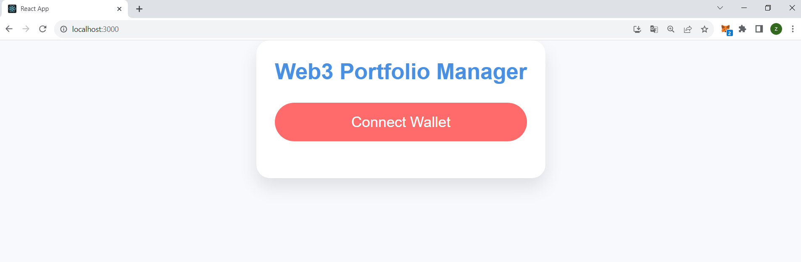
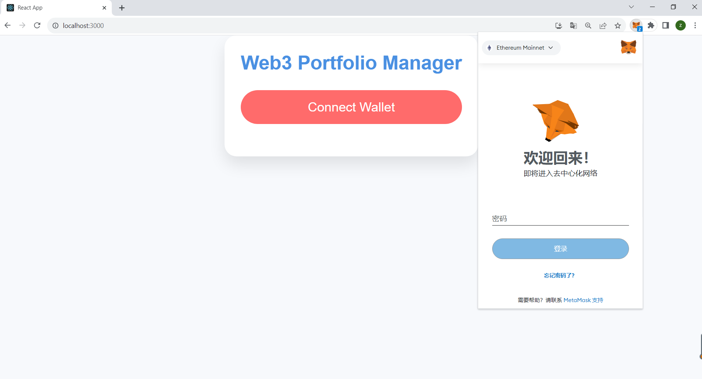
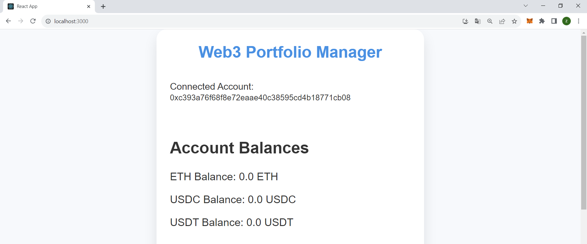
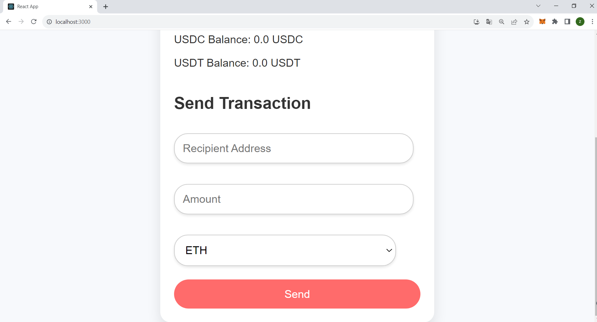
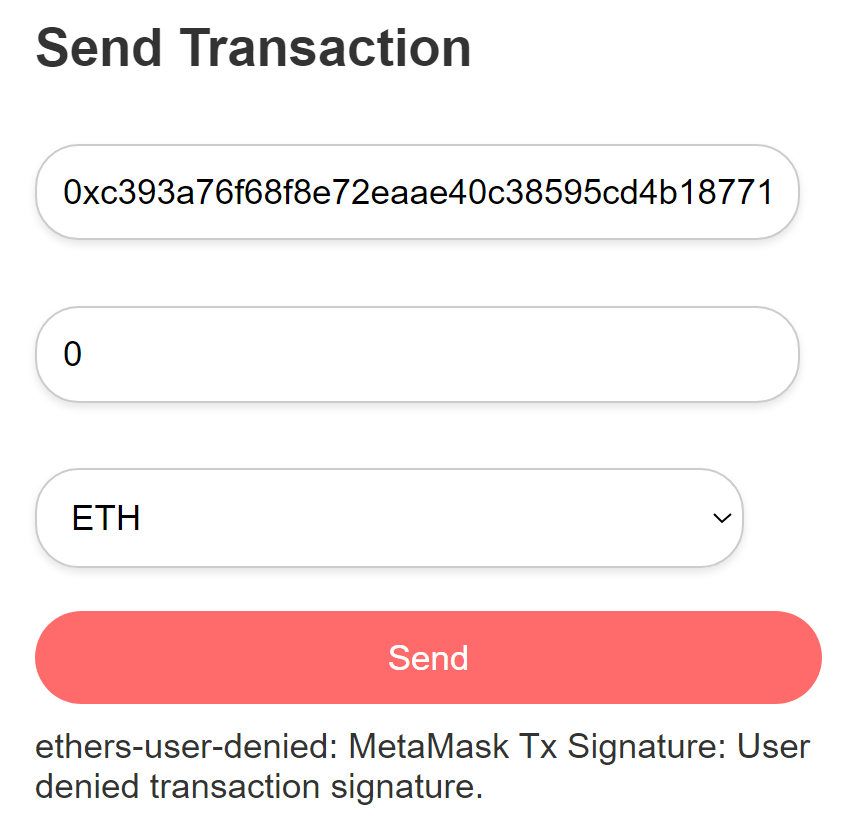
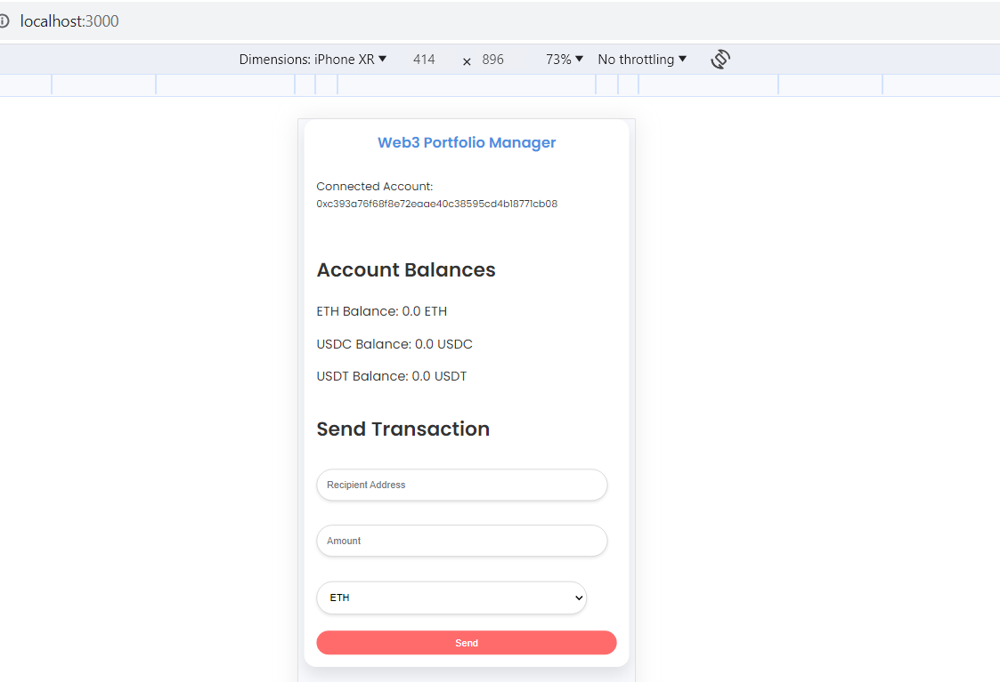

# Web3 Portfolio Manager

## Overview

The Web3 Portfolio Manager is a application built with React and ethers.js. This project enables users to connect their MetaMask wallet, view balances of popular assets (ETH, USDC, USDT), and execute transactions directly on the Ethereum blockchain. The project is designed to offer a seamless and user-friendly experience with robust error handling and responsive design.

## Features

### 1. Wallet Connection

**Description:**  
The wallet connection functionality is a crucial part of this dApp. It allows users to connect their MetaMask wallet to the application securely. Once connected, the user's wallet address is displayed, and they can interact with other features of the app.

**Key Points:**
- **MetaMask Integration:** The application uses MetaMask for connecting to the Ethereum network.
- **Connection Status:** Users are notified when their wallet is successfully connected.




### 2. Balance Display

**Description:**  
After connecting their wallet, users can view the current balances of ETH, USDC, and USDT directly within the application. The balances are fetched accurately in real-time from the Ethereum blockchain, providing users with up-to-date information on their assets.

**Key Points:**
- **Supported Assets:** The application displays balances for ETH, USDC, and USDT.
- **Real-Time Fetching:** Balances are fetched and updated dynamically, reflecting the latest state of the user's wallet.



### 3. Transaction Execution

**Description:**  
Users can execute transactions directly from the application. This includes selecting an asset (ETH, USDC, or USDT), inputting the desired amount, and sending it to a specified address. This feature allows for seamless interaction with the blockchain without leaving the application.

**Key Points:**
- **Asset Selection:** Users can choose between ETH, USDC, or USDT for their transactions.
- **Custom Amounts:** The app allows users to specify the exact amount they wish to send.
- **Address Input:** Transactions can be sent to any valid Ethereum address.



### 4. Error Handling

**Description:**  
Error handling is a critical aspect of this application. The app effectively manages common issues such as incorrect sending addresses, user denial of wallet connection, and other potential exceptions. This ensures a smooth user experience, even when problems arise.

**Key Points:**
- **Incorrect Address Handling:** Users are notified if the entered address is invalid.
- **User Denial:** The app gracefully handles cases where users deny the wallet connection request.
- **General Exceptions:** Other errors are caught and displayed to the user in a user-friendly manner.



### 5. Styling and Design

**Description:**  
The application features a clean, modern design with responsive styling to ensure usability across different devices. The UI is designed to be intuitive, with clear instructions and feedback at every step of the user journey.

**Key Points:**
- **Responsive Design:** The app is fully responsive and works well on both desktop and mobile devices.
- **Modern Aesthetics:** A visually appealing color scheme and layout enhance the user experience.
- **Intuitive UI:** The design prioritizes user-friendliness, ensuring that even those new to Web3 can navigate the app with ease.



## Getting Started

### Prerequisites

- [Node.js](https://nodejs.org/)
- [MetaMask](https://metamask.io/) extension installed in your browser

### Installation

1. Clone the repository:
    ```bash
    git clone https://github.com/Zhaobo-Wang/web3-portfolio-manager.git
    ```
2. Navigate to the project directory:
    ```bash
    cd web3-portfolio-manager
    ```
3. Install dependencies:
    ```bash
    npm install
    ```
4. Start the development server:
    ```bash
    npm start
    ```

### Usage

1. Open the application in your browser.
2. Click on "Connect Wallet" to link your MetaMask wallet.
3. View your ETH, USDC, and USDT balances.
4. Execute transactions by selecting an asset, inputting an amount, and specifying the recipient's address.
